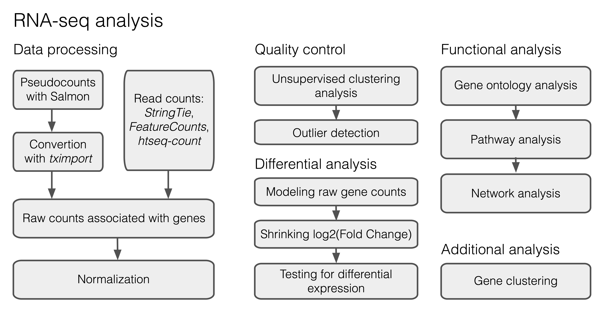

# (PART\*) Lecture 4: DE analysis {.unnumbered}

# Input dataset

Today we will focus on the differential gene expression analysis to study the gene expression signatures of microglia from accelerated aging mice subjected to PBS (phosphate buffered saline) and LPS (lipopolysaccharides, activated microglia) treatments from Zhang et al., 2022 (<https://doi.org/10.1186/s12974-022-02463-5>). Our dataset includes 2 experimental groups of replicates: Control and KO microglia, where KO group corresponds to to the model of accelerated aging, caused by deficiency of the DNA-repair associated gene Ercc1. One half of the samples in each group we additionally treated with PBS and another half were treated with LPS to achieve pro-inflammatory microglial activation. Raw reads were already preprocessed by the authors of the original study, therefore we can skip a large part devoted to raw read processing and mapping (Figure 1), that you already studied during the previous lecture and start with a table of counts. The input dataset is accessible here:

-   Course server: `/home/d.smirnov/homework4/Data/Data.csv`
-   Yandex disk: <https://disk.yandex.ru/d/2X3QgYRa5iqcFw>

 **Figure 1.** DE analysis typical workflow

Import libraries:

```{r, results='hide', message=FALSE, warning=FALSE}
library(dplyr)
library(ggplot2)
library(DESeq2)
library(DOSE)
library(pheatmap)
library(tibble)
library(clusterProfiler)
```

## Count table importing

We will start the analysis with uploading **raw** count data to the R workspace.

```{r}
data <- read.csv("data/Data.csv", row.names = 1)
```

The gene expression table has gene names in the rows and samples names in the columns. 'Length' column denotes a length of each annotated gene:

```{r}
paged_table(head(data))
```

Further we will need a meta table which maps our samples to the corresponding sample groups that we are investigating. Our metadata will include three columns of interest: "Genotype", "Treatment" and "SampleID".
```{r}
meta <- colnames(data) %>% 
        .[-c(1)] %>% strsplit(split = '_') %>% 
        as.data.frame() %>% 
        t() 
rownames(meta) <- colnames(data)[-c(1)]
colnames(meta) <- c("Genotype", "Treatment", "SampleID")
meta <- as.data.frame(meta)
```

Check the generated meta table:

```{r}
knitr::kable(meta)
```

Another important step is a filtering of the low- and non-expressed genes prior statistical analysis. Such genes contributes to the False Discovery Rate. We will keep only those genes having at least 10 counts in total across experimental replicates.

```{r}
data <- data[rowSums(data[,-c(1)]) > 10, ]
```

## DESeq2 object

Let's start the main part of the analysis with creating the `DESeqDataSet` object. To create this object we will need the count matrix and the metadata table as input. We will also need to specify a design formula. The design formula specifies the column(s) in the metadata table and how they should be used in the analysis. For our dataset we only have two column we are interested in, that is $\sim Treatment + Genotype$. The $Genotype$ is the main factor of interest, therefore it is in the end of the design formula.

Create DESeq2Dataset object:

```{r}
dds <- DESeqDataSetFromMatrix(countData = round(data[,-c(1)]), 
                              colData = meta, 
                              design = ~ Treatment + Genotype)
```

Check what is inside the object:
```{r}
dds
```
