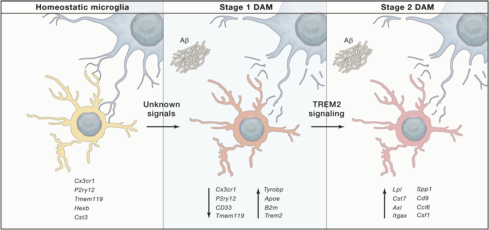

# Visualization

Once we obtained the lists of differentially expressed genes for each condition, it would be good to make sense of them. This chapter is devoted to the visual representation of DE results, that greatly helps with results interpretation.

## Volcano plot

The most standard way to visualize the obtained gene expression changes is volcano plot. This plot shows the direction of gene expression changes (up- or down-regulated) and also highlight the top DE genes.

We will utilize `EnhancedVolcano` library:

```{r, results='hide', message=FALSE, warning=FALSE}
library(EnhancedVolcano)
```

The volcano plot requires the information about gene log2(Fold Changes) for X-axis and corresponding adjusted p-values, plotted in Y-axis. In addition, you may specify the column in the DE table that can be used for gene annotation in the plot.

Code below will execute `EnhancedVolcano()` function:

```{r volcano, cache = TRUE, fig.width = 10, fig.height = 5.5, fig.align = "center"}
p1 <- EnhancedVolcano(res_pbs_tb,
        lab = res_pbs_tb$SYMBOL, 
        x = 'log2FoldChange',
        y = 'padj', 
        title = 'KO vs Control, PBS',
        subtitle = NULL,
        pCutoff = 0.05, 
        FCcutoff = 0.58)

p2 <- EnhancedVolcano(res_lps_tb,
        lab = res_lps_tb$SYMBOL, 
        x = 'log2FoldChange',
        y = 'padj', 
        title = 'KO vs Control, LPS',
        subtitle = NULL,
        pCutoff = 0.05, 
        FCcutoff = 0.58)

cowplot::plot_grid(p1, p2, nrow = 1)
```

## Heatmap of significant genes

Another way to visualize DE genes and their changes in expression is using heatmap 
We also will extract the normalized values of all the significant genes and plot a heatmap of their expression using `pheatmap()` function:

Convert normalized_counts to a data frame and transfer the row names to a new column called "gene"
```{r}
normalized_counts <- counts(dds_analysis, normalized = T) %>%
                data.frame() %>%
                rownames_to_column(var="gene")
```

Extract normalized expression for significant genes:
```{r}
norm_sig_pbs <- normalized_counts %>%
                filter(gene %in% sig_pbs$gene) %>% column_to_rownames('gene')

norm_sig_lps <- normalized_counts %>%
                filter(gene %in% sig_lps$gene) %>% column_to_rownames('gene')
```

Plot the heatmap:
```{r pheatmap, cache = TRUE, fig.width = 5, fig.height = 7, fig.align = "center"}
pheatmap(norm_sig_pbs, 
                cluster_rows = T,
                show_rownames = F,
                annotation = meta[,c(1,2)],
                border_color = NA,
                fontsize = 10,
                scale = "row",
                fontsize_row = 10,
                height = 10)
```

## Comparison with DAM markers
Disease-associated-microglia (DAM) is a microglia type associated with various neurodegeneration diseases (AD, ALS, aging) and characterized by a specific transcriptional program. We will work with DAM signatures described in Deczkowska et al., 2018 (<https://doi.org/10.1016/j.cell.2018.05.003>) and in the Figure 2. This signatures can be divided in three main groups or stages: markers of homeostatic microglia, Stage 2 DAM (independent on TREM2 signaling) signatures and markers of Stage 2 DAM of microglial activation, caused by TREM2 signaling. 


 

**Figure 2**: DAM stages in mouse: homeostatic microglia -> Stage DAM 1 -> Stage DAM 2. Figure was taken from Deczkowska et al., 2018.

::: design
**Task 3**: Analyze changes in expression of DAM marker genes in the both PBS and LPS comparisons. Plot a heatmap of the DAM signature expression levels (0.5 points) and volcano plots for expression changes in DAM signatures for both comparisons (0.5 points). Do the observed changes in your data correspond to the changes in disease-associated microglia? Provide an explanation (0.5 points).
:::
