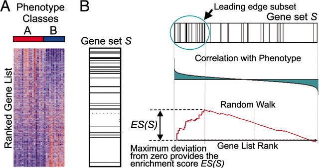

# Functional analysis

The main idea of the functional analysis is to connect observed changes in gene expression with associated altered cellular pathways and biological functions. Below we will try the most well-known methods allowing to gain some insight into biological interpretation of the obtained DE results.

## Gene Ontology (GO) analysis

Gene Ontology analysis is probably the most popular and widely-used method.

The hypergeometric test, that is identical to one-sided Fisher's exact test, is typically used for over-representation analysis and the p-value of the significance is calculated in the following way:

$$ p = 1 - \sum_{i = 0}^{k-1} \frac{\binom{M}{i} \binom{N-M}{n-i}}{\binom{N}{n}} $$
where 

* $N$ is a total number of genes in the background

* $M$ is a number of genes in the background that are also in the GO category

* $n$ is a total number of DE genes 

* $k$ is number of DE genes that are also in the GO category

While the over-representation analysis can be easily done with many packages in R, the most popular is `ClusterProfiler`. GO analysis with `ClusterProfiler` can be easily done with `enrichGO` function:

```{r}
ego_pbs <- enrichGO(gene = sig_pbs$gene, 
                    universe = res_pbs_tb$gene, 
                    keyType = "ENSEMBL",
                    OrgDb = org.Mm.eg.db, 
                    ont = "BP",
                    pAdjustMethod = "BH", 
                    pvalueCutoff = 0.05)

ego_lps <- enrichGO(gene = sig_lps$gene,
                                universe = res_lps_tb$gene, 
                                keyType = "ENSEMBL",
                                OrgDb = org.Mm.eg.db, 
                                ont = "BP",
                                pAdjustMethod = "BH", 
                                pvalueCutoff = 0.05)
```

We will use boxplots to visualize the enriched categories:
```{r go_bp, cache = TRUE, fig.width = 10, fig.height = 4.5, fig.align = "center"}
cowplot::plot_grid(barplot(ego_pbs), barplot(ego_lps), nrow = 1)
```

## Pathway analysis
Over-representation analysis using reference data on KEGG pathways can be done in a similar way, but now we must use `enrichKEGG` function and utilize NCBI ENTREZ IDs as input:
```{r}
ekegg_pbs <- enrichKEGG(gene = na.omit(sig_pbs$ENTREZID),
                    organism = 'mmu',
                    pvalueCutoff = 0.05,
                    universe = na.omit(res_pbs_tb$ENTREZID))

ekegg_lps <- enrichKEGG(gene = na.omit(sig_lps$ENTREZID),
                    organism = 'mmu',
                    pvalueCutoff = 0.05,
                    universe = na.omit(res_lps_tb$ENTREZID))
```

**Note**: If you work on the course computational cluster, you can encounter the error "No gene can be mapped ...". This issue is incompatibility between the currently installed `clusterProfiler` version and KEGG database. Here we suggest a workaround to avoid this problem:

```{r, eval = FALSE}
install.packages("/home/d.smirnov/KEGG.db_1.0.tar.gz", 
                 repos=NULL,
                 type="source") # run this in terminal

library(KEGG.db)

ekegg_pbs <- enrichKEGG(gene = na.omit(sig_pbs$ENTREZID),
                    organism = 'mmu',
                    pvalueCutoff = 0.05,
                    universe = na.omit(res_pbs_tb$ENTREZID), 
                    use_internal_data = T)

ekegg_lps <- enrichKEGG(gene = na.omit(sig_lps$ENTREZID),
                    organism = 'mmu',
                    pvalueCutoff = 0.05,
                    universe = na.omit(res_lps_tb$ENTREZID), 
                    use_internal_data = T)

## Now the output of the enrichKEGG() is generated, but the Description column consist of NAs. 
## We will add missing pathway names manually from the KEGG.db we just uploaded.

ekegg_pbs@result$Description <- unlist(as.list("KEGG.db"::"KEGGPATHID2NAME")[ekegg_pbs@result$ID])
ekegg_lps@result$Description <- unlist(as.list("KEGG.db"::"KEGGPATHID2NAME")[ekegg_lps@result$ID])
```

Since recently, the description of KEGG pathways in the `clusterProfiler` output data include the part related to a species name, which is `- Mus musculus .(house mouse).` in this case. This annoying text complicates visualization of the enriched pathways, so we will get rid of it:

```{r}
ekegg_pbs@result$Description <- sub(" - Mus musculus .(house mouse).", "", ekegg_pbs@result$Description)
ekegg_lps@result$Description <- sub(" - Mus musculus .(house mouse).", "", ekegg_lps@result$Description)
```

Another (and a little bit more complex) way to visualize pathway enrichment results is to use upsetplots, showing co-occurring DE gene sets in respect to the altered pathways they associated with:

```{r}
library(enrichplot)
```

```{r}
ups_pbs <- enrichplot::upsetplot(ekegg_pbs)
ups_lps <- enrichplot::upsetplot(ekegg_lps)
```

```{r upset1, cache = TRUE, fig.width = 10, fig.height = 4.5, fig.align = "center"}
ups_pbs
```

```{r upset2, cache = TRUE, fig.width = 10, fig.height = 4.5, fig.align = "center"}
ups_lps
```

## Gene-Set Enrichment Analysis (GSEA)

Unlike hypergeometric distribution based methods, GSEA works in the assumption that even small and not significant, but coordinated changes in gene expression can have impact on cellular pathways. Therefore, GSEA uses statistics of **all** the genes in a dataset, taking log2 Fold Changes as an input.


 

**Figure 3**: The general principle of GSEA. The figure was taken from Subramanian et al., (2005) <https://doi.org/10.1073/pnas.0506580102>

Since GSEA interpretation in `clusterProfiler` rely on NCBI ENTREZ IDs, we will filter out genes not annotated in ENTREZ:

```{r}
pbs_filtered <- filter(res_pbs_tb, ENTREZID != "NA")
lps_filtered <- filter(res_lps_tb, ENTREZID != "NA")
```

Select gene log2(Fold Changes) and assign NCBI ENTREZ IDs as names of the vectors:

```{r}
foldchanges.pbs <- pbs_filtered$log2FoldChange
names(foldchanges.pbs) <- as.character(pbs_filtered$ENTREZID)

foldchanges.lps <- lps_filtered$log2FoldChange
names(foldchanges.lps) <- as.character(lps_filtered$ENTREZID)
```

Sort fold changes:

```{r}
foldchanges.pbs <- sort(foldchanges.pbs, decreasing = TRUE)
foldchanges.lps <- sort(foldchanges.lps, decreasing = TRUE)
```

Now, we can run `gseKEGG()` function with sorted fold changes as input and using default parameters

```{r}
gseaKEGG.pbs <- gseKEGG(geneList = foldchanges.pbs,              
                    pAdjustMethod = "fdr",
                    organism = "mmu", 
                    nPerm = 2000, 
                    minGSSize = 10, 
                    pvalueCutoff = 0.05, 
                    verbose = FALSE, 
                    seed = TRUE)


gseaKEGG.lps <- gseKEGG(geneList = foldchanges.lps,              
                    pAdjustMethod = "fdr",
                    organism = "mmu", 
                    nPerm = 2000, 
                    minGSSize = 10, 
                    pvalueCutoff = 0.05, 
                    verbose = FALSE, 
                    seed = TRUE)
```

**Note**: If you work on the course cluster, you will have an "No gene can be mapped ..." bug again. As before, use `use_internal_data = T` to overcome this:

```{r, eval = FALSE}
## KEEG.db is already loaded

gseaKEGG.pbs <- gseKEGG(geneList = foldchanges.pbs,              
                    pAdjustMethod = "fdr",
                    organism = "mmu", 
                    nPerm = 2000, 
                    minGSSize = 10, 
                    pvalueCutoff = 0.05, 
                    verbose = FALSE, 
                    seed = TRUE, 
                    use_internal_data = T)


gseaKEGG.lps <- gseKEGG(geneList = foldchanges.lps,              
                    pAdjustMethod = "fdr",
                    organism = "mmu", 
                    nPerm = 2000, 
                    minGSSize = 10, 
                    pvalueCutoff = 0.05, 
                    verbose = FALSE, 
                    seed = TRUE, 
                    use_internal_data = T)

gseaKEGG.pbs@result$Description <- unlist(as.list("KEGG.db"::"KEGGPATHID2NAME")[gseaKEGG.pbs@result$ID])
gseaKEGG.lps@result$Description <- unlist(as.list("KEGG.db"::"KEGGPATHID2NAME")[gseaKEGG.lps@result$ID])
```

Remove the species name in the pathway description again:

```{r}
gseaKEGG.pbs@result$Description <- sub(" - Mus musculus .(house mouse).", "", gseaKEGG.pbs@result$Description)
gseaKEGG.lps@result$Description <- sub(" - Mus musculus .(house mouse).", "", gseaKEGG.lps@result$Description)
```

Check the results for both comparisons:

```{r}
paged_table(gseaKEGG.pbs@result)
```

```{r}
paged_table(gseaKEGG.lps@result)
```

Apart from the adjusted p-values, enrichment score is another important characteristic of the altered pathways, reflecting the degree of which gene sets are over-represented at the top or at the bottom of the input ranked gene lists. You may find the corresponding values in enrichmentScore column of `gseaKEGG.pbs` and `gseaKEGG.lps` tables.

Below is a GSEA plot for three manually selected enriched pathway from the PBS comparison:

```{r gseaplot2, cache = TRUE, fig.width = 9.5, fig.height = 5.5, fig.align = "center"}
enrichplot::gseaplot2(gseaKEGG.pbs, geneSetID = c(15, 23, 29), pvalue_table = TRUE,
          color = c("#E495A5", "#86B875", "#7DB0DD"), ES_geom = "dot")
```

Please note, that your enriched pathways could be different from the ones showed in the plot above! 

## Gene Set Enrichment Analysis with mSigDB
In the section above we used GO terms and KEGG pathways to perform enrichment analyses, but sometimes it is needed to compare gene expression changes against other gene sets, such as signatures or markers of the various diseases and biological processes. A possible solution is to use Molecular Signatures Database (mSigDB) represents the curated lists of gene sets, divided in 9 main collections:

* H: Hallmark gene sets

* C1: Positional gene sets

* C2: Curated gene sets

* C3: Motif gene sets

* C4: Computational gene sets

* C5: Gene Ontology gene sets

* C6: Oncogenic signatures gene sets

* C7: Immunologic signatures

* C8: Cell type signatures

In R this database is already available through the `msigdbr` package:
```{r}
library(msigdbr)
```

While mSigDB contains annotated gene sets for many species (you can get a list of them with `msigdbr_show_species()`), we will specify 'mouse' to retrieve mouse-related sets for the Hallmark gene sets:
```{r}
msig_h <- msigdbr(species = "mouse", category = "H")
```

Next, prepare an input reference table for enrichment analysis:
```{r}
msigdbr_t2g <- msig_h %>%
  dplyr::distinct(gs_name, ensembl_gene) %>%
  as.data.frame()
```

This table consist of two columns, one for gene set names (specific terms) and another one for the corresponding ENSEMBL IDs:
```{r}
paged_table(head(msigdbr_t2g))
```
Run the over-presentation analysis on significant genes with prepared term-to-gene table using `enricher()` function:
```{r}
hallmarks.pbs <- enricher(gene = sig_pbs$gene, TERM2GENE = msigdbr_t2g)
hallmarks.lps <- enricher(gene = sig_lps$gene, TERM2GENE = msigdbr_t2g)
```

Visualize the obtained enriched terms for PBS comparison:
```{r hallmarks_pbs, cache = TRUE, fig.width = 7, fig.height = 5.5, fig.align = "center"}
dotplot(hallmarks.pbs)
```

... and for LPS comparison:
```{r hallmarks_lps, cache = TRUE, fig.width = 7, fig.height = 5.5, fig.align = "center"}
dotplot(hallmarks.lps)
```

To run the GSEA analysis with mSigDB terms we must select NCBI ENTREZ IDs instead of ENSEMBL ones:
```{r}
msigdbr_t2g <- msig_h %>%
  dplyr::distinct(gs_name, entrez_gene)
```

Now execute `GSEA` function with `foldchanges.pbs` gene list and re-generated term-to-gene annotation:
```{r}
gsea_h_pbs <- GSEA(foldchanges.pbs, TERM2GENE = msigdbr_t2g)
```

Check out the enriched terms:
```{r}
paged_table(head(gsea_h_pbs))
```
An essential part of DE analysis is the validation of the obtained gene expression changes with custom gene sets, identified by other researches in similar experiments. Here we will use previously described enrichment methods to compare our changes against a list of DAM metabolites.

::: design
**Task 5**: Perform GSEA on `foldchanges.pbs` and `foldchanges.lps` lists using DAM-related genes as an argument for `TERM2GENE = ...` in `GSEA()` function (1.5 point).
:::

::: design
**Task 6**: So far we did the enrichment analysis for all the obtained DE genes per comparison, but sometimes it is useful to focus on the specific groups of DE genes. For example, one can split DE gene set into down- or up-regulated subsets and test them with the enrichment methods, but in this task you will be asked to accomplish a more complicated, but, in the same time, more interesting analysis: 

* First, perform clustering of your DE genes (you can use DE set for the comparison you prefer most) to identify groups of genes with similar expression trends. The most straightforward method here is hierarchical clustering, but you can also any other adequate gene clustering methods you like. 

* Next, choose the number of clusters based on some criteria. It can be the Gap-Statistics, the Silhouette or any other appropriate method you like.

* Perform the enrichment analysis (`enrichGO`/`enrichKEGG`) on the groups of genes you like most, two or three groups will be enough. Provide the plots and also comment on the enrichment results obtained.

As it was mentioned, this task is more challenging, but is it close as possible to the real research tasks relevant to the DE results interpretation. 

This task will give you 1 point. Have fun!
:::
