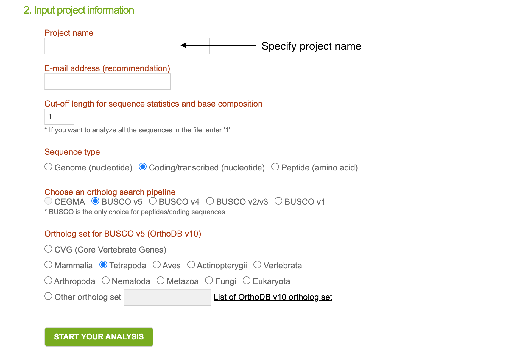

# Transcriptome assembly QC

## Obtain assembly statistics
Trinity has `TrinityStats.pl` script to compute basic assembly statistics, including N50 metrics, estimating the 'length of the shortest contig, for which longer and equal length contigs cover at least 50 % of the assembly' [1]

```{bash, eval = FALSE}
TrinityStats.pl Trinity.fasta
```

::: design
**Task 1**: How many trinity 'genes' and 'transcripts' did you get? (0.5 points).
:::

## Transcript filtering
Now we want to filter out short redundant contigs that were erroneously assembled by Trinity. CD-HIT tool calculates transcript similarity values and merge transcripts based on similarity threshold of 98%.

```{bash, eval = FALSE}
cd-hit-est -o cdhit -c 0.98 -i trinity_out_dir/Trinity.fasta -p 1 -d 0 -b 3 -T 2 -M 1000
```

where `-p` is for printing an alignment overlap in `.clstr` file, `-b` represents band_width of alignment, `-T` is a number of threads and `-M` is a memory limit (in MB).

After filtering new filtered assembly will be stored in `cdhit` file. Rename it to avoid confusion:

```{bash, eval = FALSE}
mv cdhit Trinity.filtered.fasta
```

Run QC script on filtered assembly again
```{bash, eval = FALSE}
TrinityStats.pl  Trinity.filtered.fasta
```

::: design
**Task 2**: How many trinity 'transcripts' were filtered out from the assembly?
:::

## Assembly completeness with gVolante
To assess completeness of the obtained assembly we will use gVolante web tool. Transfer filtered `.fasta` transcriptome to your local machine and then open https://gvolante.riken.jp/analysis.html.

Upload your .fasta file, it may take few minutes:

 

Select `Coding/transcribed (nucleotide)` sequence type and `BUSCO v5` as a pipeline to use. Select "Tetrapoda" as an ortholog set for `BUSCO v5`. Then click on `Start your analysis`.

 

::: design
**Task 3**: Report BUSCO scores (*Complete and single-copy*, *Complete and duplicated*, *Fragmented*, or *Missing BUSCOs*) and a number of assembly transcripts that are > 1K in their length.
:::
